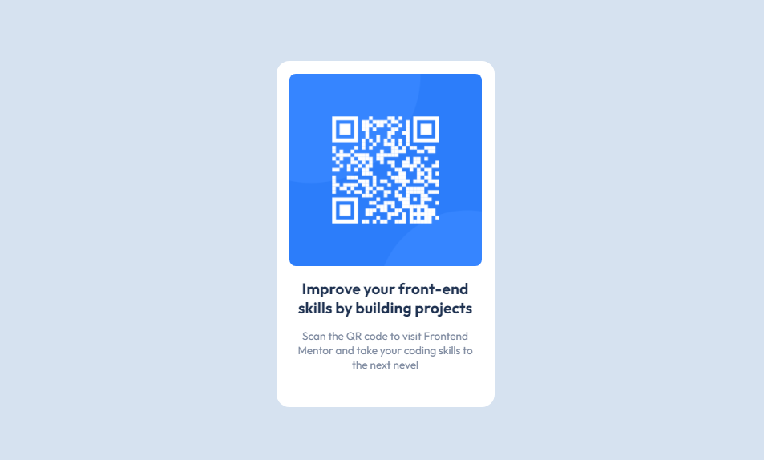

# Frontend Mentor - QR code component solution

This is a solution to the [QR code component challenge on Frontend Mentor](https://www.frontendmentor.io/challenges/qr-code-component-iux_sIO_H). Frontend Mentor challenges help you improve your coding skills by building realistic projects. 

## Table of contents

- [Overview](#overview)
  - [The challenge](#the-challenge)
  - [Screenshot](#screenshot)
  - [Links](#links)
- [My process](#my-process)
  - [Built with](#built-with)
  - [What I learned](#what-i-learned)
  - [Useful resources](#useful-resources)
- [Author](#author)

## Overview

### Screenshot

### Links

- #### [Solution](https://github.com/CosmoArt/QR-code-component-solution)
- #### [Live Site](https://www.frontendmentor.io/solutions/qr-code-component-solution-HJ1wJzFXD)

## My process

### Built with

- Semantic HTML5 markup
- CSS custom properties

### What I learned

This challenge was a great learning opportunity, it was also very useful to reinforce previous knowledge, and face problems that had not been presented to me before

### Useful resources

- [Fix the 4PX GHOST SPACE problem](https://simonerescio.it/en/2014/05/4px-ghost-space-with-css-display-inline-block) - This helped me understand a little more how the css layout works..

## Author

- Instagram - [@cosmo_art0](https://www.instagram.com/cosmo_art0/)
- Frontend Mentor - [@CosmoArte](https://www.frontendmentor.io/profile/CosmoArt)
- Twitter - [@CosmoArt0](https://twitter.com/CosmoArt0)
